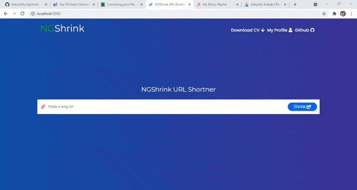

# NGShrink Mern App (Express.js / React)

Ngshrink is a web app made with react js on the frontend and a
node express server on the backend. It turn long urls into
shorter ones.

## NGShrink

I built this App based on the mern stack (Express.js / React ).

**Live App Demo** : [https://ngshrink.herokuapp.com/](https://ngshrink.herokuapp.com/)

## App Features :

### Backend :

- The backend is built with node.js , [express.js Framework](https://expressjs.com/)

### Frontend :

- The Frontend is built with React.js.
- Beautiful UI

##  Author

Adeyemi Kolade (2021).
